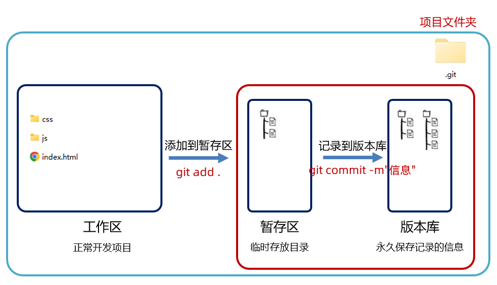
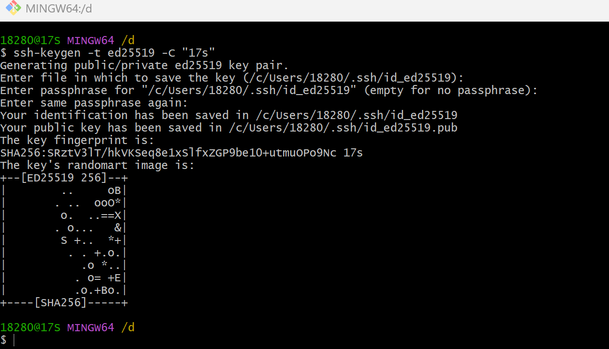

# git操作

## git安装

```
windows安装：
    1. 根据操作系统类型下载
    2. 双击安装安装包
    3. 全部使用默认设置
    4. 通过鼠标右键确认安装结果
```

## 基础操作

### 基础知识

```
1、配置用户信息和初始化
	a. 设置全局用户名 git config --global user.name "Your Name" 
	b. 设置全局邮箱   git config --global user.email "you@example.com"
	c. 查看配置 git config --list
	d. 初始化git仓库  git init
2、使用Git进行版本控制的项目中的3个区
	工作区，暂存区，本地仓库
3、记录每次更新到仓库的核心操作
	工作区开发->添加到暂存区->记录到本地仓库
	工作区开发->git add . ->git commit -m "提交信息"
```

```
将所有更改添加到暂存区  git add .   
将暂存区的文件提交到本地仓库 git commit -m "提交信息"

可以将上面俩句合并成一句,但是新创建的文件并不会提交到本地仓库
git commit -am "提交信息"
```




> git开始管理文件是从把文件添加到暂存区开始的，因为添加到暂存区后，git就开始追踪这些文件的变化了，而真正形成版本记录是在提交到本地仓库之后。

### 查看及切换版本

查看历史记录

```
a. 查看简略的提交信息: git log --oneline
b. 查看详细的提交信息: git log
c. 查看完整的提交信息: git reflog
d. 切换指定版本: git reset --hard 版本号
e. 取消所有文件的修改: git reset --hard
```

### 查看文件状态

通过`git status`命令查看文件处于什么状态

```
a. 红色: 工作区有文件更改
b. 绿色: 暂存区有文件更改
c. nothing to commit: 没有任何文件更改
```

### 查看及切换分支

```
查看分支: git branch
查看远程仓库的分支: git branch -r
创建分支: git branch 新分支名
切换分支: git checkout 分支名
创建+切换分支: git checkout –b 新分支名
合并分支: git merge 分支名    将分支合并到当前分支
删除分支: git branch -d 分支名
强制删除分支: git branch –D 分支名
重命名分支: git branch –m 老分支名新分支名
```

合并分支：将这个分支合并到当前分支。

在`master`分支上`commit`3次，然后创建并切换到`dev`分支，继续`commit`2次,然后切换回`master`分支进行合并，此时这俩个分支上的`commit`都是5次

**【合并冲突】**：不同分支对同一个文件的用一个地方进行了不同的修改，然后合并时就会出现问题。会出现如下信息
"Automatic merge failed; fix conflicts and then commit the result."。自动合并失败；修复冲突，然后提交结果。

解决办法：修改这个文件，选择你要保留的内容，然后重新提交。

### git忽略文件

`.gitignore` 文件

```
# 这里演示的部分语法
# #之后的内容是注释 会被Git忽略
# 忽略 info.txt 文件
info.txt
# 忽略 .vscode/ 目录下所有的文件
.vscode
# 忽略目录下所有.md结尾的文件
*.md
# 会忽略 doc/目录下扩展名为txt的文件
doc/*.txt

#忽略aaa目录下的所有文件
aaa/
```

## 远程仓库操作

### 关联远程仓库

```
git remote add origin <repository-url>
```

`origin`是远程仓库的别名，这个别名可以随便设置

```
关联远程仓库时系统会询问
Are you sure you want to continue connecting (yes/no/[fingerprint])?
就是询问你是否要继续连接，输入`yes`

为什么会询问呢？因为使用了SSH来关联远程仓库
```

**【注意】**：将本地文件上传到已有的远程仓库的分支中的步骤。1、克隆远程仓库。2、将本地文件添加到克隆下来的远程仓库中。3、提交并推送。

### 删除远程仓库

```
git remote remove 远程仓库名
```

远程仓库的名称一般是`origin`

### 查看远程仓库信息

```
git remote -v
```

> 这条命令，会显示远程仓库读取(fetch)或推送(push)的url

### 推送到远程仓库

**【本地分支推送到远程仓库(首次)】**

```
（主要）分支名相同：git push -u origin 分支名
（了解）分支名不同：git push -u origin 本地分支名:远程分支名
```

【**注意事项**】

```
a. -u ：将本地分支和远程分支进行关联，后续的拉取(pull)和推送(push)操作不需要再显式的去指定远程分支
      推送：git push  origin 分支名
      拉取：git pull origin 分支名
```
**【git push】**：将本地分支新的提交推送到远程分支

【但是一般都是这样说】将本地新的提交推送到远程仓库

> 新的提交: 也许是一次提交，也许是多次提交。上一次(拉取或推送)操作到这次操作之间的所有提交叫做新的提交

### 从远程仓库拉取

**【远程分支新的提交拉取到本地分支并合并】**

```
（主要）分支名相同：git pull origin 分支名
（了解）分支名不同：git pull origin 远程分支名:本地分支名
```

**【注意事项】**

```
如果前面首次推送分支时，设置了-u 只要 git pull 即可
```

### 获取远程仓库最新的更新

```
git fetch -p
-p ：远程仓库中有分支删除时，会自动删除本地仓库中的该分支 
```

### 克隆远程仓库

```
git clone <repository-url>
```

### 使用ssh连接远程仓库

**【密钥】**：用来加密和解密信息的字符串或数字

**【对称密钥】**：使用同一个密钥进行加密和解密信息

**【非对称密钥】**：有公钥和私钥之分，公钥用于加密信息，私钥用于解密信息。公钥可以公开，私钥必须保密

用公钥加密的信息只有用对应的私钥才能解开

**【例子】**

```
假设 Alice 想向 Bob 发送一条安全消息：

1. Bob 生成一对公钥和私钥，并将公钥发送给 Alice。
2. Alice 使用 Bob 的公钥加密消息，并将加密后的消息发送给 Bob。
3. Bob 接收到消息后，使用自己的私钥解密消息。

这样，只有 Bob 能解密 Alice 发送的消息。
```

**【使用方式】**

```
生成ssh密钥对 ssh-keygen -t ed25519 -C "任意名字"
查看及拷贝公钥  cat ~/.ssh/id_ed25519.pub
配置公钥到gitee
测试ssh连接 ssh -T git@gitee.com
```

> a. -c  给生成的密钥添加注释，可以是你的电子邮件地址、设备名称或任何你希望用来识别该密钥的字符串。
> b. -t  设置密钥类型，根据密钥算法来生成密钥对（公钥和私钥）。
> c. `ed25519`密钥算法是目前生成SSH密钥的最佳选择
> d. 私钥： id_ed25519  公钥：id_ed25519.pub
> e. 在windows下密钥所在的位置：`C:\Users\18280\.ssh`
> f. SSH 公钥配置到 GitHub 或 Gitee 只需要**配置一次**，之后对该账号下的所有仓库都有效。

生成密钥时，1、会让你选择文件的保存路径，直接敲回车 使用默认路径。2、接着会让你设置密码来保护你的私钥，直接敲回车，就是不设置密码。3、会让你再次输入密码以确认。

如下图所示，密钥生成成功




### 小结

```
a. 拉取操作和推送操作的目的是用来同步分支的。
b. 所以在每次推送之前，都先拉取一下远程分支的代码(拉取新的提交)，确保此时本地分支是最新的，这样你推送之后本地和    远程的分支才是同步的。（如果直接推送的话，假设推送成功了，那么此时本地分支和远程分支的提交是不同步的）
```

   

